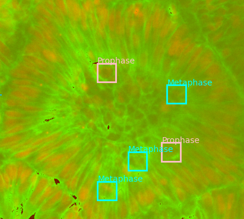
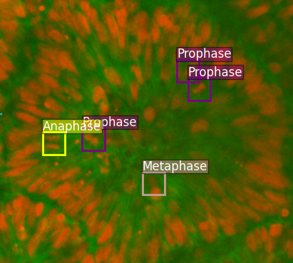

#  BOrg: A Brain Organoid-Based Mitosis Dataset for Automatic Analysis of Brain Diseases
<p align="center">
    
</p>

#### [Awais Rauf](https://awaisrauf.github.io/), [Mehaboobathunnisa Sahul Hameed]() , [Bidisha Bhattacharya](), [Orly Reiner](), and [Rao Anwer](https://mbzuai.ac.ae/study/faculty/rao-muhammad-anwer/)

#### Mohamed Bin Zayed University of Artificial Intelligence (MBZUAI) and Weizmann Institute of Science

[](https://github.com/awaisrauf/borg) [](https://arxiv.org/pdf/2406.19556) []()


<p align="center">
  
  <!--  -->
</p>


## 📢 Latest Updates

- **Nov, 2024**: Dataset is released.
- **June, 2024**: Arxiv paper released.  

---

## Overview

Recent advances have enabled studying human brain development using brain organoids derived from stem cells. Quantifying cellular processes like mitosis in these organoids offers insights into neurodevelopmental disorders, but the manual analysis is time-consuming, and existing datasets lack specific details for brain organoid studies. We introduce BOrg, a dataset designed to study mitotic events in the embryonic development of the brain using confocal microscopy images of brain organoids. BOrg utilizes an efficient annotation pipeline with sparse point annotations and techniques that minimize expert effort, overcoming limitations of standard deep learning approaches on sparse data. We adapt and benchmark state-of-the-art object detection and cell counting models on BOrg for detecting and analyzing mitotic cells across prophase, metaphase, anaphase, and telophase stages. Our results demonstrate these adapted models significantly improve mitosis analysis efficiency and accuracy for brain organoid research compared to existing methods. BOrg facilitates the development of automated tools to quantify statistics like mitosis rates, aiding mechanistic studies of neurodevelopmental processes and disorders.

## 🖼️ Dataset

The dataset consists of a 2D transformation of 4D confocal microscopic images of brain organoids. It is provided in [mmdetection](https://github.com/open-mmlab/mmdetection) format and can directly be used to train models in mmdetection.

### Statistics

| **Phases** | **Train** | **Validation** | **Total** |
|------------|-----------|----------------|-----------|
| Prophase   | 282       | 82             | 364       |
| Metaphase  | 146       | 62             | 208       |
| Anaphase   | 69        | 24             | 93        |
| Telophase  | 59        | 13             | 72        |

### Projections

We employ two projection methods to transform images from a 4D to a 2D format.

<table>
    <tr>
        <td>
            
            <p align="center"> </p>
        </td>
        <td>
            
            <p align="center"> </p>
        </td>
    </tr>
</table>

## 🚆Training

This dataset can be used directly with [mmdetection](https://github.com/open-mmlab/mmdetection) to train detection models.

## 📜 Citation

```bibtex
@article{awais2024borg,
  title   = {BOrg: A Brain Organoid-Based Mitosis Dataset for Automatic Analysis of Brain Diseases},
  author  = {Muhammad Awais and Mehaboobathunnisa Sahul Hameed and Bidisha Bhattacharya and Orly Reiner and Rao Muhammad Anwer},
  year    = {2024},
  journal = {arXiv preprint arXiv: 2406.19556}
}
```
